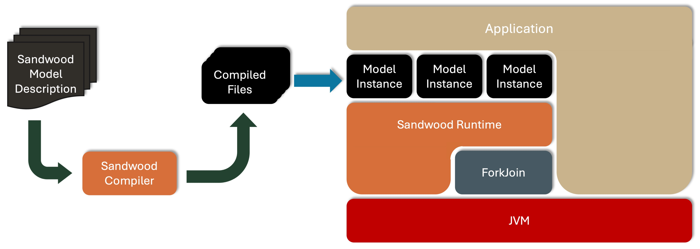
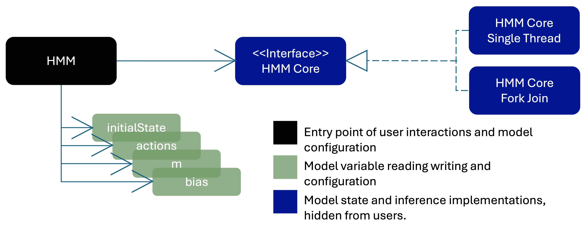

# Sandwood
Sandwood is a language, compiler, and runtime for JVM based probabilistic models. It is designed to allow models to be written in a language that is familiar to Java developers. The resulting models take the form of Java objects allowing them to be well abstracted components of an encompassing system.

## What is probabilistic programming?
With a traditional Bayesian Model the user has to design the model, and then implement inference code for any operation they wish to perform on the model. This creates a number of issues:

1. Constructing inference code is technically challenging to do, and time consuming. This step presents an opportunity for subtle bugs to be introduced.

2. If the model is modified, then the inference code will have to be updated. This is also time consuming and technically challenging, leading to the following problems:

  * It acts as a deterrent to modifying models.

  * It is possible for different inference operations to get out of step so some work on the old model and some work on the new model.

  * It presents another opportunity for bugs to get in the inference algorithm as users try to make subtle adjustments to existing code.
	
3. Looking at the code it is hard to see what the model is. This harms maintainability.

Probabilistic programming overcomes these issues by allowing models to be described using either an API, or a domain specific language (DSL) as is the case with Sandwood. The [Sandwood DSL](docs/Sandwood.md) is compiled to produce Java classes that represent the model and implement all the required inference operations. This has a number of advantages:
* Users are no longer required to handle the technical complexity of constructing inference code.
* Updating the model is now just requires changes to the high-level language and then recompilation to generate the new inference code.
* Models described in the high-level language are much more understandable improving code maintainability.
* All the inference operations are guaranteed to be for the same model.
* User bugs are confined to the model, with the inference code coming from the compiler.

## Installation
Sandwood consists of 3 components each in their corresponding directory:

- The compiler and runtime (Sandwood)
- The plugin for Maven (SandwoodMavenPlugin)
- A set of example models (SandwoodExamples)

Each piece is dependent on the preceding pieces. Each component directory contains a Maven POM file to construct the component. For the compiler and the plugin these will need to be called with `install` to make them available for later stages, i.e. `mvn clean install`. The examples should only be built as `mvn clean package`.

Having installed Sandwood there are currently 3 ways of compiling a model:
1. A command line tool.
2. A Java library call.
3. A Maven plugin.

### Command Line Tool
To use Sandwood from the command line once the compiler and runtime have been built command line scripts that have similar functionality to `javac` can be found in `commandline/SandwoodC/bin`. To use this the user would typically add the bin directory to the path, then call sandwoodc.sh HMM.sandwood to compile the HMM model. `sandwoodc.sh -h` or `sandwoodc.bat -h` will result in a description of the usage and available options being printed out.

### Java Library Call
All the functionality of SandwoodC can be reached by calling the method `compile` in `org.sandwood.compilation.SandwoodC` and passing an array containing the arguments that would have been passed to the command line.

### Maven Plugin
The Maven plugin can be used to automatically trigger compilation of sandwood files when the dependent project is built. To use the plugin you need to add the sandwood runtime as a dependency, and add the plugin to the build. This is achieved with the following additions to the POM file:

```
<dependencies>
	<dependency>
		<groupId>org.sandwood</groupId>
		<artifactId>sandwood-runtime</artifactId>
		<version>0.3.0</version>
	</dependency>
</dependencies>
```

```
<build>
	<plugins>
		<plugin>
			<groupId>org.sandwood</groupId>
			<artifactId>sandwoodc-maven-plugin</artifactId>
			<version>0.3-SNAPSHOT</version>
			<executions>
				<execution>
					<configuration>
						<partialInferenceWarning>true</partialInferenceWarning>
						<sourceDirectory>${basedir}/src/main/java</sourceDirectory>
					</configuration>
					<goals>
						<goal>sandwoodc</goal>
					</goals>
				</execution>
			</executions>
		</plugin>
	</plugins>
</build>`
```

The inclusion of the element `<sourceDirectory>${basedir}/src/main/java</sourceDirectory>` instructs the plugin which directory to look in for models. Other useful flags include:

* `debug` This option is used to obtain debugging information from SandwoodC. Setting this option to `true` causes Sandwood to generate a trace of its actions. The default value is `false`. Note this flag is for debugging errors with the compiler configuration/compiler, not with the model being compiled. Errors and warnings in the sandwood model files will always be returned by the compiler.

* `partialInferenceWarning` This option is used to stop SandwoodC from failing when some inference steps cannot be constructed. Setting this option to `true` causes Sandwood to just generate warnings on missing steps. Default value is `false`.

* `sourceDirectory` This parameter sets which directory to look in for model files. Within this directory the models can be located in different packages.

* `outputDirectory` This parameter sets which directory the Java source code for the models should be placed into. The default value is `${project.build.directory}/generated-sources/sandwood`.

* `calculateIndividualProbabilities` This parameter specifies if the probabilities for each random variable constructed  in a loop should be calculated instead of a single value for all instances. The default value is `false`.

* `javadoc` This parameter instructs the compiler to generate JavaDoc to compliment the model. The default value is `false`.

* `javadocDirectory` This parameter specifies the location that the generated should be placed.

* `executable` This parameter allow for an alternative JVM to be specified to run the Sandwood compiler with.

## Documentation
What follows is an introduction to how to write Sandwood models and how to use the resultant classes that implement the models. 

An outline of the steps a model goes through can be seen in this diagram. Models start as a `.sandwood` file that is compiled to a set of class files. These can be instantiated multiple times to generate multiple instances of the model with different configurations.




### Example Model
As a running example we will use a [Hidden Markov Model (HMM)](https://en.wikipedia.org/wiki/Hidden_Markov_model). This model is written here in Sandwood. This model should be saved in a file called `HMM.sandwood` in a package directory `org/sandwood/examples/hmm`. A fuller description of the language can be found [here](docs/Sandwood.md).

```java
package org.sandwood.examples.hmm;
 
model HMM(int[] eventsMeasured, int numStates, int numEvents) {
  //Construct a transition matrix m.
  double[] v = new double[numStates] <~ 0.1;
  double[][] m = dirichlet(v).sample(numStates);
 
  //Construct weighting for which state to start in.
  double[] initialState = new Dirichlet(v).sample();
      
  //Construct weighting for each event in each state.
  double[] w = new double[numEvents] <~ 0.1;
  double[][] bias = dirichlet(w).sample(numStates);
 
  //Allocate space to record the sequence of states.
  int sequenceLength = eventsMeasured.length;
  int[] st = new int[sequenceLength];
 
  //Calculate the movements between states.
  st[0] = categorical(initialState).sampleDistribution();
  for (int i: [1..sequenceLength) )
    st[i] = categorical(m[st[i - 1]]).sampleDistribution();
 
  //Emit the events for each state.
  int[] events = new int[sequenceLength];
  for (int j = 0; j < sequenceLength; j++)
    events[j] = new Categorical(bias[st[j]]).sample();
    
  //Assert that the events match the eventsMeasured data.
  events.observe(eventsMeasured);
}
```

In addition to the documentation of the Sandwood language and the JavaDoc comment that can be generated for a model there are a number of examples in the Sandwood Examples directory and we suggest new users start by examining and modifying these.

### Sandwood language
A description of the language used to describe Sandwood models can be found [here](docs/Sandwood.md). The language is constructed with the intent of being familiar to Java developers, but does not contain the ability to construct Objects. We plan to add support for record types in the future to make the import and export of data to and from models simpler.

### Compiled models
When a model is compiled a number of class files are generated in the same package that the model is defined in. One of these classes will have the same name as the name provided to the model, so in this case  _HMM.class_ , and this is the class that the user should instantiate in order to have an instance of the model. Each publicly visible variable in the model corresponds to a field in the generated class. The [example HMM](#example-model) can be seen below.



By running the compiler with the `javadoc` flag set JavaDoc will be created for each public method and class in the generated model file.

### Using Compiled Models
Once the model has been compiled we need to instantiate instances of it. These instances are independent and the user can create as many different copies of the model as they wish.

#### Constructing a model
Instances of the model object are constructed via the class constructor. As described earlier there are typically 3 constructors for the model. The only case when there will be fewer is when the different variants of the constructor map to the same signature, in which case one constructor will apply to more than one of these scenarios.

* Full constructor - This constructor takes all the arguments that appear in the model signature and sets them. This constructor is used for the infer values and infer probabilities operations.

* Empty constructor - This constructor takes no arguments, leaving the parameters for the user to set later.

* Execution Constructor - This constructor removes arguments that are only observed, and for observed arguments whose dimensions are used as inputs to the code, takes those dimensions instead of the full parameters. So in the HMM example the eventsMeasured parameter will become an integer describing the length of the sequence.

These code samples demonstrate how to make calls to the compiled models.

#### Interacting with a model
Interactions with a model via the model object takes two forms:

* Calls to model object methods for global operations such as setting default retention policies, checking if the model is ready for inference, and starting inference steps, etc. 

* Calls to model parameter objects. Each named public variable in the model is represented by a corresponding field in the model object. Variables are public if they are declared in the outermost scope of the model and not labelled `private`, or are declared in an inner scope and are not labelled `public`. If a field is declared public in an inner iterative scope, for example the body of a for loop, the value from each iteration will be stored.

  The type of the object will depend on the variable. These can be split into 3 categories:
  1. Observed variables: These are scalar or array variables that are set by the user.
  2. Inferred variables: These are scalar or array variables inferred by the model.
  3. Random variables: These [Random Variables](https://en.wikipedia.org/wiki/Random_variable) declared as named fields in the model. These can only have their probability queried.

  Each of these fields references an object with a set of methods that allow the user to set and read values and properties from the parameter. Properties that can be set and read include the probability of the parameter, the retention policy of the parameter, and if the parameter should be fixed at its current value.

Some of the more important methods of the parameter object when performing model inference are:

  * getSamples to return sampled values.

  * getMAP to return the [Maximum A Posteriori](https://en.wikipedia.org/wiki/Maximum_a_posteriori_estimation) value.

  * setValue to allow a value to be set to a specific value.

  * setFixed which takes a `boolean` to mark the value as fixed, and therefore not to be updated during inference. It is important to set the value of the parameter before fixing it.
  
  * getLogProbability which gets the log probability of the variable after inferring probabilities.
    
There are more methods, and we recommend consulting the JavaDoc to familiarise yourself with them.

#### Model operations

There are 3 basic types of operation that can be performed on a model:

1. **Infer Values** Having set the value of some of the variables of a model, infer values for the remaining variables. For the results of this method to be of interest some of the inferred values will need to be recorded. This can be done by recording the inferred values for every unset variable in the model model, or just a subset of the variables. The retention policy can be set for the entire model by a call to the method `setRentionPolicy` in the model class. Optionally individual variables can then have their retention policy set by calls to the corresponding `setRetentionPolicy` method in each variable object.

There are 3 sampling policies:
  * _NONE_  records no values. This is particularly useful if one of the variables is large so taking the time and space to store it would be wasteful.

  * _SAMPLE_  records the value from every iteration of the inference algorithm, so if 1000 iterations are performed 1000 values will be sampled from the each variable set to this retention policy. This is useful for calculating the variance as well as the average value. There is a weakness to this though, if the positions of values within the model can move during the inference then the values cannot be averaged over. For example with a topic model topics 2 and 3 may swap places during the inference, so averaging all the values for topic 2 with produce a mixture of topic 2 and topic 3. To overcome this Maximum A Posteriori (MAP) is also provided as a retention policy.

  * _MAP_  or [Maximum A Posteriori (MAP)](https://en.wikipedia.org/wiki/Maximum_a_posteriori_estimation) records the values of the variables when the model is in its most probable state. This overcomes the issue with transient value positions meaning values cannot be averaged, but at the expense of being able to calculate bounds. This option also has space advantages if some of the variables are large.

Configuration: Additional method calls on the model object allow the user to set properties such as  _burnin_  and  _thinning_  when performing this inference step. Burnin ignores the values from the first  _n_  iterations allowing the model to move away from a low probability starting point before starting to sample. Thinning reduces the autocorrelation induced by the MCMC procedure by only considering the values from every  _n_ th iteration.

2. **Infer Probabilities** Having set the values of some or all the parameters in the model calculate the probability of generating those values. This can be calculated for each variable in the model and for the model as a whole. 

3. **Execute Model** Run the model as if it was regular code generating new values for any parameters that are not fixed by the user. An example of when this behaviour would be used is for a linear regression model. In this case the model coefficients would first be inferred using training data. Once they have been inferred they would be fixed and new input data set. The model would then be executed to generate the corresponding predictions for this new input data. This form of execution could also be used to generate representative synthetic data from a trained model.

**Construct and train a model**

```java
//Load inputs
int nStates = 25;
int[] actions = loadActions(....);
int nActions = maxActions(....);

//Construct the model
HMM model = new HMM(actions, nActions, nStates);

//Set the retention policies
model.setDefaultRetentionPolicy(RetentionPolicy.MAP);
model.st.setRetentionPolicy(RetentionPolicy.NONE);

//Pick a random number generator. The ones introduced in Java 17 are faster and better quality.
model.setRNGType(RandomType.L64X1024MixRandom);

//Instruct the model to use the ForkJoin framework for parallel execution.
model.setExecutionTarget(ExecutionTarget.forkJoin);

//Run 2000 inference steps to infer model values
model.inferValues(2000);

//Gather the results.
double[] initialState = model.initialState.getMAP();
double[][] bias = model.bias.getMAP();
double[][] transitions = model.m.getMAP();
```

**Construct model and infer probabilities**

```java
//Load inputs
int nStates = 25;
int[] actions = loadActions(....);
int nActions = maxActions(....);

//Load model parameters
double[][] bias = model.bias.getMAP();
double[][] transitions = model.m.getMAP();

//Construct the model
HMM model = new HMM(actions, nActions, nStates);

//Set and fix trained values
model.bias.setValue(bias);
Model.m.setValue(transitions);

//Run 2000 inference steps to infer probabilities
model.inferProbabilities(2000);

//Recover the probabilities of the model parameter actions.
double actionsProbability = model.actions.getProbability();

//Recover the probability of the model as a whole
double modelProbability = model.getProbability()
```

**Train and execute a Liner Regression model**

```java
//Load parameters
double[] xs = loadXs(....);
double[] ys = loadYs(....);

//Construct the model
LinearRegression model = new LinearRegression(xs, ys);
…
//Run 2000 inference steps to c, m, and sigma.
model.inferValues(2000);

//Fix the inferred values
model.c.setFixed(true);
model.m.setFixed(true);
model.sigma.setFixed(true);

//Set new input values
double[] new_xs = loadXs(....);
model.xs.setValue(new_xs);

//Run the model to generate sequences of actions using the inferred values
model.execute(1000);

//Recover the generated values
double[][] new_ys = model.ys.getSamples();
```

## Help
For help with Sandwood please start or join a discussion on the [discussions page](https://github.com/oracle/sandwood/discussions).

## Contributing
This project welcomes contributions from the community. Before submitting a pull
request, please [review our contribution guide](./CONTRIBUTING.md).

## Security

Please consult the [security guide](./SECURITY.md) for our responsible security
vulnerability disclosure process.

## License
Copyright (c) 2019-2024 Oracle and/or its affiliates.

Released under the Universal Permissive License v1.0 as shown at
<https://oss.oracle.com/licenses/upl/>.

