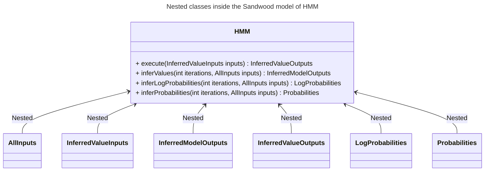

# Version

Git branch name: `main`

Version of the Sandwood compiler and runtime system: `0.6.0-SNAPSHOT`

Target OS: Linux and macOS

# Setting the Stage

## Resources

[Sandwood GitHub repository](https://github.com/oracle/sandwood/)

[Sandwood language reference](https://github.com/oracle/sandwood/blob/main/docs/Sandwood.md)

## Prerequisites

To build and run Sandwood, we need
- Java 17+
- Maven 3.8.1+.

## Probabilistic Programming

Probabilistic programming is a programming paradigm for performing Bayesian
inference. A probabilistic model is specified as a program written in a
domain-specific language (DSL) called a probabilistic programming language
(PPL). The PPL offers constructs for probabilistic modeling (e.g., sampling from
probability distributions and conditioning on observed data). Finally, to
perform Bayesian inference, the user executes a (fixed or customizable)
inference engine of the PPL.

### Bayesian Inference

To describe Bayesian inference, let $\theta$ be a *latent variable* and $y$ be
an *observed variable*. Here, the latent variable $\theta$ is a random variable
that the user would like to infer but cannot observe, and the observed variable
$y$ is a random variable the user can observe.

A *probabilistic model* $p(\theta, y)$ specifies a joint probability
distribution over the latent variable $\theta$ and the observed variable $y$. A
probabilistic model typically has the form $p(\theta, y) = p(\theta) \cdot p(y
\mid \theta)$, where $p(\theta)$ is called the *prior distribution* and $p(y
\mid \theta)$ is called the *likelihood*.

**Workflow**

The workflow of Bayesian inference is as follows:
1. The user writes a probabilistic model $p(\theta, y)$.
2. The user collects observed data $D$.
3. The user calculates the posterior distribution $p(\theta \mid y=D)$ (i.e.,
   the conditional distribution of the latent variable $\theta$ conditioned on
   the observed data $y=D$).

The posterior distribution $p(\theta \mid y=D)$ is given by Bayes' rule:

$$p(\theta \mid y=D) = \frac{p(\theta, y=D)}{p(y=D)} = \frac{p(\theta, y=D)}{\int p(\theta, y=D) \mathrm{d}\theta}.$$

Here, the denominator $\int p(\theta, y=D) \mathrm{d}\theta$ is called *(model)
evidence*.

In the denominator of Bayes' rule (i.e., $\int p(\theta, y=D)
\mathrm{d}\theta$), the integral is typically over a high-dimensional space of
the latent variable $\theta$. Consequently, it may be computationally
intractable to perform exact probabilistic inference, that is, calculate the
exact posterior distribution using Bayes' rule directly. Instead, in practice,
we run sampling-based probabilistic inference to draw a large number of
posterior samples:

$$\theta_1, \ldots, \theta_M \sim p(\theta \mid y=D).$$

These (finitely many) posterior samples are then used as an approximation of the
true posterior distribution $p(\theta \mid y=D)$.

**Terminology**

This guide mostly sticks to the following terminology for Bayesian inference:
- Latent variable $\theta$: it is also known as a model parameter, unobserved
  variable, and hidden variable in the literature.
- Observed variable $y$: it is also known as a visible variable.
- Evidence $p(y=D)$: it is also known as marginal likelihood.

# Overview of Sandwood

Sandwood is a language, compiler, and runtime for JVM-based probabilistic
models. It is designed to allow models to be written in a language that is
familiar to Java developers. The resulting models take the form of Java objects
allowing them to be well abstracted components of an encompassing system.

**Workflow**

Here is the workflow of programming in Sandwood:
1. The user writes a Sandwood model that describes a probabilistic model. The
   Sandwood model is stored in a file with the file extension `.sandwood`, say
   `Model.sandwood`.
2. The user also writes a Java application, say `Application.java`, to interact
   with the (compiled) Sandwood model. Specifically, this Java application
   prepares observed data for Bayesian inference, invokes Sandwood's inference
   engine, and processes the inference result.
3. The user compiles the Sandwood model `Model.sandwood` and the Java
   application `Application.java`. The Sandwood compiler is invoked to compile
   the Sandwood model `Model.sandwood` into a set of class files, one of which
   is `Model.class`. The Java compiler compiles the application
   `Application.java` into `Application.class`.
4. The user runs the program `Application.class`, which calls the compiled
   Sandwood model `Model.class` at runtime. The compiled model `Model.class` in
   turn calls (i) other class files generated by the Sandwood compiler and (ii)
   the Sandwood runtime system (abbreviated to Sandwood runtime). All of these
   class files run on top of the JVM.

**Supported inference algorithms**

For probabilistic inference, Sandwood currently supports Gibbs sampling. We plan
to extend the set of supported inference algorithms.

# Getting Started

This section describes how to build and run Sandwood.

The Sandwood repository has three subdirectories: `Sandwood`,
`SandwoodMavenPlugin`, and `SandwoodExamples`. The `Sandwood` directory contains
source code for the Sandwood compiler and the runtime system. The
`SandwoodMavenPlugin` directory contains source code for a custom Maven plugin
that runs a Sandwood compiler on a user-specified Sandwood model. Finally, the
`SandwoodExamples` directory contains (i) example Sandwood models and (ii) Java
applications that interact with the Sandwood models.

## Build Sandwood

Before building Sandwood, make sure Java SDK and Maven have been installed.

First, clone the Sandwood repository (e.g., from GitHub):
```bash
git clone git@github.com:oracle/sandwood.git
```

Next, we build and install the Sandwood compiler and runtime. Go to the
subdirectory `Sandwood` by running
```bash
cd Sandwood
```
and then run
```bash
mvn install -DskipTests
```
This command will skip tests, which can take a long time. To perform testing in
addition to the build, run
```bash
mvn install
```
After this command, in the local Maven repository  (typically
`~/.m2/repository`), you should be able to find subdirectories
`org/sandwood/sandwood-compiler` and `org/sandwood/sandwood-runtime`, which
store the built Sandwood compiler and runtime, respectively.

Next, we build and install a custom Maven plugin that runs the Sandwood compiler
on a user-written Sandwood model. Go to the subdirectory `SandwoodMavenPlugin`
in the Sandwood repository by running
```bash
cd ../SandwoodMavenPlugin
```
Then run
```bash
mvn install
```
After this command, you should find a directory
`~/.m2/repository/org/sandwood/sandwoodc-maven-plugin`, which stores the custom
Maven plugin for compiling Sandwood models.

To build all artifacts in the codebase (i.e., the compiler, runtime environment,
Maven plugin, and Sandwood models), run
```bash
mvn install
```
in the root directory of the project. It will run unit tests as well. To skip
tests, run
```bash
mvn install -DskipTests
```

The command `mvn install` will install all artifacts (e.g., Sandwood compiler),
placing them in the directory
```bash
/Users/longpham/.m2/repository/org/sandwood
```
where `org/sandwood` corresponds to the group ID `org.sandwood` of these
artifacts (as specified in their POM files).

Alternatively, to build each individual artifact, we can go to a corresponding
subdirectory and run an appropriate command. In the subdirectories `Sandwood`
and `SandwoodMavenPlugin`, we run
```bash
mvn install
```
in these subdirectories. In the subdirectory `SandwoodExamples`, we run
```bash
mvn package
```

## Run an Example Sandwood Model

### Compile a Sandwood Model

The subdirectory `SandwoodExamples` of the Sandwood repository contains example
Sandwood models and Java applications for interacting with the Sandwood models.
To run them, go to this subdirectory and run
```bash
mvn package
```
It compiles all Sandwood models and Java applications in this subdirectory.

If you just want to compile a specific example of a Sandwood model, go to an
individual subdirectory (e.g., `SandwoodExamples/coinBias/`) and then run
```bash
mvn package
```

As specified in the POM file `SandwoodExamples/pom.xml`, running `mvn package`
in this directory (or any of its child subdirectories) invokes the custom
Sandwood Maven plugin (named `sandwoodc-maven-plugin`), which in turn runs the
Sandwood compiler on the Sandwood models.

### View Javadoc

The Maven plugin also produces a Javadoc. For instance, for the example
`SandwoodExamples/coinBias`, go to the directory
`SandwoodExamples/coinBias/target/javaDoc/sandwood` and run
```bash
open index.html
```
This command opens a Javadoc for the Sandwood model
`SandwoodExamples/coinBias/src/main/java/org/sandwood/examples/coin/CoinModel.sandwood`
on your web browser. This Javadoc shows the API of the Sandwood model, listing
what methods can be called by the user in order to interact with the Sandwood
program.

### Run a Java Application

For illustration, let us focus on the example directory
`SandwoodExamples/coinBias`. It contains two programs:
- Sandwood model
  `SandwoodExamples/coinBias/src/main/java/org/sandwood/examples/coin/CoinModel.sandwood`
- Java application
  `SandwoodExamples/coinBias/src/main/java/org/sandwood/examples/coin/CoinBiasEstimatorMK1.java`,
  which calls the Sandwood model `CoinModel.sandwood`.

After running `mvn package` in either the directory `SandwoodExamples` or
the directory `SandwoodExamples/coinBias`, you can run the Java application
`CoinBiasEstimatorMK1.java` (more precisely, run its compiled class file) in two
ways:
- From an IDE (e.g., IntelliJ IDEA and Eclipse);
- From the command line.

To run the Java application from the IDE, it should suffice to just click a
button for running a program - the IDE should be able to figure out where to
find dependencies, unless you deviate from the default system configuration.

To run the Java application `CoinBiasEstimatorMK1.java`, run the command (from
any location in the file system):
```bash
java -cp <path-to-Sandwood-repository>/Sandwood/runtime/target/sandwood-runtime-0.6.0-SNAPSHOT-jar-with-dependencies.jar:<path-to-Sandwood-repository>/SandwoodExamples/coinBias/target/classes org.sandwood.examples.coin.CoinBiasEstimatorMK1
```
Here, the option `-cp` (short for `-classpath`) specifies the locations of
dependencies. Specifically, the `-cp` option specifies the locations of (i)
directories containing class files (or top-level directories if the class files
are stored inside Java packages) and (ii) JAR files. In the above command, the
`-cp` option specifies two paths:
- `<path-to-Sandwood-repository>/Sandwood/runtime/target/sandwood-runtime-0.6.0-SNAPSHOT-jar-with-dependencies.jar`:
  This JAR file stores the Sandwood runtime.
- `<path-to-Sandwood-repository>/SandwoodExamples/coinBias/target/classes`: This
  is a directory that Maven automatically creates during the build to store
  class files.

## Run a Custom Sandwood Model

This section illustrates how to write your own custom Sandwood model and a Java
application to interact with it. By way of example, we consider a Hidden Markov
model (HMM) with a discrete state space.

### Write a Sandwood Model

First, create a new project directory, say `HMMExample`, somewhere in your file
system. Next, create a file
`HMMExample/src/main/sandwood/com/example/HMM.sandwood` that contains the
following Sandwood model. At this point, you do not need to carefully read the
model to understand its syntax - we describe it later in the document.

```java
package com.example;

model HMM(int[][] eventsMeasured, int noStates, int noEvents, double dirichletHyperparameter) {
       // Construct vectors describing the probability of a move from 1 state to another.
       double[] v = new double[noStates] <~ dirichletHyperparameter;
       double[] v2 = new double[noEvents] <~ dirichletHyperparameter;
       double[][] m = dirichlet(v).sample(noStates);

       // Construct the bias for each webpage.
       double[][] bias = dirichlet(v2).sample(noStates);

       // Determine how many samples the model will need to produce.
       int samples = eventsMeasured.length;

       // Allocate space for the state, i.e. which webpage we are going to trigger an event on.
       int[][] st = new int[samples][];
       for(int i = 0; i < samples; i++){
          int streamLength = eventsMeasured[i].length;
          st[i] = new int[streamLength];
       }

       // Set the initial state by sampling from a categorical with learnt weightings.
       double[] initialStateDistribution = dirichlet(v).sample();
       for(int i = 0; i < samples; i++) {
          st[i][0] = categorical(initialStateDistribution).sampleDistribution();
       }

       // Determine the remaining states based on the previous state.
       for(int i = 0; i < samples; i++){
          int streamLength = eventsMeasured[i].length;
          for(int j = 1; j < streamLength; j++){
             st[i][j] = categorical(m[st[i][j-1]]).sampleDistribution();
          }
       }

       // Generate each event.
       int[][] events = new int[samples][];
       for(int i = 0; i < samples; i++) {
          int streamLength = eventsMeasured[i].length;
          events[i] = new int[streamLength];
          for(int j = 0; j < streamLength; j++){
             events[i][j] = categorical(bias[st[i][j]]).sample();
          }
       }

       // Tie the values of the flips to the values we have measured.
       events.observe(eventsMeasured);
}
```

**Brief walk-through of the Sandwood model**

This Sandwood model defines an HMM that takes four inputs: (i) observed
data `eventsMeasured`, which is a set of sequences of observations; (ii) the
number of states `noStates`, (iii) the number of distinct events (i.e.,
observations) `noEvents`, and (iv) a (hyper)parameter of Dirichlet distributions
`dirichletHyperparameter`.

The latent variable `m` stores transition probabilities for a Markov chain in
HMM, and the latent variable `bias` stores emission probabilities (i.e., the
probabilities of each observation given a hidden state). The latent variable
`initialStateDistribution` stores the initial states, and the latent variable
`st` stores hidden states.

The variable `events` is an observed variable, and it is conditioned on the
observed data `events_observed` in the last line:
```java
events.observe(eventsMeasured);
```

### Write a Java Application to Use the Sandwood Model

Next, we write a Java application to interact with the Sandwood model
`HMM.sandwood`. Place the following code inside the file
`HMMExample/src/main/java/com/example/HMMApplication.java`:
```java
package com.example;

import java.util.Arrays;

import org.sandwood.random.RandomType;
import org.sandwood.runtime.model.RetentionPolicy;

class HMMApplication {

    public static void main(String[] args) {
        int[][] eventsMeasured = { { 0, 1, 2, 0, 1, 2, 0, 1, 2 }, { 1, 0, 2, 1, 0, 2, 1, 0, 2 } };
        int numStates = 3;
        int numEvents = 3;
        double dirichletHyperparameter = 0.1;
        HMM hmmModel = new HMM(eventsMeasured, numStates, numEvents, dirichletHyperparameter);

        // Fix (i) the type of a PRNG and (ii) its seed
        hmmModel.setRNGType(RandomType.L64X1024MixRandom);
        long seed = 42;
        hmmModel.initializeSeed(seed);
        hmmModel.setDefaultRetentionPolicy(RetentionPolicy.MAP);
        hmmModel.inferValues(4000);

        // Extract MAP estimates
        double[][] biasMAP = hmmModel.bias.getMAP();
        double[][] mMAP = hmmModel.m.getMAP();
        double[] initialStateDistributionMAP = hmmModel.initialStateDistribution.getMAP();

        // Display MAP estimates
        System.out.printf("MAP emission probabilities:%n%s%n", Arrays.deepToString(biasMAP));
        System.out.printf("MAP transition probabilities:%n%s%n", Arrays.deepToString(mMAP));
        System.out.printf("MAP initial state distribution:%n%s%n", Arrays.toString(initialStateDistributionMAP));

        hmmModel.close();
    }
}
```

**Brief walk-through of the Java application**

This Java application first prepares observed data (i.e., `eventsMeasured`) and
hyperparameters (e.g., `noStates`). It then constructs an HMM model by calling a
constructor
```java
HMM hmmModel = new HMM(eventsMeasured, numStates, numEvents, dirichletHyperparameter);
```
The program then fixes the pseudorandom number generator (PRNG) type and its
seed by
```java
hmmModel.setRNGType(RandomType.L64X1024MixRandom);
long seed = 42;
hmmModel.initializeSeed(seed);
```
It is not mandatory to set the PRNG type and seed. If the user does not set
them, Sandwood uses some default PRNG with no fixed seed. However, in order for
an experiment to be reproducible, we must fix the PRNG algorithm and seed.

Next, the program sets the retention policy to `MAP` and then runs
sampling-based probabilistic inference (specifically Gibbs sampling) with 4000
iterations by
```java
hmmModel.setDefaultRetentionPolicy(RetentionPolicy.MAP);
hmmModel.inferValues(4000);
```
The `MAP` retention policy means that, during Gibbs sampling, Sandwood tracks
(i.e., retains) the MAP estimate (i.e., a sample with the highest probability or
density in the posterior distribution $p(\theta \mid y=D)$) of each latent
random variable.

Finally, the MAP estimates of three latent variables are extracted as follows:
```java
double[][] biasMAP = hmmModel.bias.getMAP();
double[][] mMAP = hmmModel.m.getMAP();
double[] initialStateDistributionMAP = hmmModel.initialStateDistribution.getMAP();
```

### Create a POM file

Next, create a POM file `HMMExample/pom.xml` that contains the following code:
```xml
<project xmlns="http://maven.apache.org/POM/4.0.0"
         xmlns:xsi="http://www.w3.org/2001/XMLSchema-instance"
         xsi:schemaLocation="http://maven.apache.org/POM/4.0.0 http://maven.apache.org/xsd/maven-4.0.0.xsd">
    <modelVersion>4.0.0</modelVersion>

    <groupId>com.example</groupId>
    <artifactId>HMM</artifactId>
    <version>0.6.0-SNAPSHOT</version>
    <packaging>jar</packaging>
    <name>HMM Experimentation</name>
    <properties>
	    <project.build.sourceEncoding>UTF-8</project.build.sourceEncoding>
	    <project.reporting.outputEncoding>UTF-8</project.reporting.outputEncoding>
    </properties>

    <dependencies>
	    <dependency>
		    <groupId>org.sandwood</groupId>
            <artifactId>sandwood-runtime</artifactId>
            <version>${project.version}</version>
        </dependency>
    </dependencies>

    <build>
	    <plugins>
		    <plugin>
			    <groupId>org.sandwood</groupId>
                <artifactId>sandwoodc-maven-plugin</artifactId>
                <version>${project.version}</version>
                <executions>
	                <execution>
		                <configuration>
			               <partialInferenceWarning>true</partialInferenceWarning>
					        <sourceDirectory>${basedir}/src/main/java</sourceDirectory>
                            <javadoc>true</javadoc>
                        </configuration>
                        <goals>
                            <goal>sandwoodc</goal>
                        </goals>
                    </execution>
                </executions>
            </plugin>
        </plugins>
    </build>
</project>
```

This POM file invokes the custom Maven plugin `sandwoodc-maven-plugin` for
running the Sandwood compiler on a Sandwood model. Also, the POM file
specifies the Javadoc to be generated.

### Compile the Sandwood Model and Java Application

To compile the Sandwood model `HMM.sandwood` (using the Sandwood compiler) and
the Java application `HMMApplication.java` (using the Java compiler), at the
root of the project directory `HMMExample`, run
```bash
mvn package
```

The command creates a directory `HMMExample/target`, which contains
- Class files of the compiled Sandwood model and Java application in the
  directory `target/classes`
- Java source files of the compiled Sandwood model in the directory
  `target/generated-sources`
- Javadoc in the directory `target/javaDoc`.

To view the Javadoc, go to the directory `HMMExample/target/javaDoc` and run
```bash
open index.html
```

Finally, to run the Java application `HMMApplication.java` (or more precisely,
its compiled class file), either run it from the IDE or from the command line,
as described in the previous section.

# Sandwood Probabilistic Inference

## Gibbs Sampling

To perform Bayesian inference, Sandwood runs Gibbs sampling. It belongs to the
Markov chain Monte Carlo (MCMC) family of sampling-based inference algorithms.
If we cannot draw samples from exact conditional distributions, which is
required by the standard Gibbs sampling, we fall back on the Metropolis-Hastings
sampling to draw from *approximated* conditional distributions.

Gibbs sampling works as follows. The sampler traverses the list of latent
variables, updating their values/samples successively. In the $i$-th iteration,
the Gibbs sampler updates the latent variable $x_i$ (i.e., the $i$-th latent
variable) by drawing a new sample from the conditional distribution $p(x_i \mid
x_{-i})$ (i.e., the distribution of $x_i$ conditioned on the current samples of
the remaining latent variables). The newly proposed sample for the variable
$x_i$ is always accepted.

Typically, a Gibbs sampler traverses the random variables in the same order in
each cycle of traversal. However, in Sandwood, the order of traversal is
reversed in every cycle: we traverse the random variables in some order in the
first cycle, and then traverse them in the reversed order in the next cycle.

A single cycle of traversal in Gibbs sampling is implemented by the method
`gibbsRound()` in the Java file `<Model>$SingleThreadCPU.java` generated by the
Sandwood compiler, where `<Model>` stands for the name of a user-written
Sandwood model. This file can be found in the directory
`target/generated-sources` inside a project directory.

### Sampling from Conditional Distributions

Gibbs sampling requires the ability to draw samples from an (exact or
approximated) conditional distribution $p(x_i \mid x_{-i})$. This is achieved
differently depending on the nature of the random variable $x_i$. There are
three cases to consider.

**Case 1**

If the conditional probability $p(x_{-i} \mid x_i)$ has a conjugate prior
$p(x_i)$, we can analytically compute the exact conditional distribution $p(x_i
\mid x_{-i})$ and sample from it.

**Case 2**

Suppose the random variable $x_i$ can only take finitely many possible values
(and hence is a discrete random variable). That is, the random variable $x_i$ is
drawn from a finite-support distribution. We perform marginalization to compute
the exact conditional distribution $p(x_i \mid x_{-i})$ and sample from it.
Suppose the random variable $x_i$ can take any value from a finite set
$\{v_1,\ldots,v_n\}$ ($n \in \mathbb{N}$). For each $j=1,\ldots,n$, the
conditional distribution $p(x_i = v_j \mid x_{-i})$ is then given by

$$p(x_i = v_j \mid x_{-i}) = \frac{p(x_i = v_j, x_{-i})}{p(x_{-i})} = \frac{p(x_i = v_j, x_{-i})}{\sum_{k=1}^{n} p(x_i = v_k, x_{-i})},$$

where the denominator is a finite summation and hence can be computed precisely.

**Case 3**

If the random variable $x_i$ does not fall into the previous two cases, we
perform the Metropolis-Hastings (MH) algorithm to draw samples from an
approximated conditional distribution $p(x_i \mid x_{-i})$. The resulting
sampling algorithm is commonly called the Metropolis-within-Gibbs sampling
algorithm.

### Metropolis-Hastings within Gibbs

In the MH algorithm used within Gibbs sampling, in each iteration, the sampler
proposes a new sample for the random variable $x_i$ by drawing a sample from a
proposed distribution. The sampler then probabilistically accepts or rejects the
newly proposed sample according to a so-called acceptance ratio such that the
Markov chain converges to the target distribution. In this case, the target
distribution of the MH algorithm is the conditional distribution $p(x_i \mid
x_{-i})$ to sample from in each iteration of Gibbs sampling.

Sandwood uses an appropriate proposal distribution for the MH algorithm
depending on the nature of the random variable. There are two cases to consider.

**Case 1**

If the random variable $x_i$ is continuous, Sandwood uses a normal distribution
centered at the current sample of $x_i$. This is commonly called a Gaussian
drift proposal. The standard deviation of this Gaussian drift proposal
distribution is the maximum of (i) some positive constant and (ii) the random
variable $x_i$'s absolute value multiplied by some factor. We take the maximum
of these two quantities such that when $x_i$'s current sample is close to 0, the
standard deviation of the Gaussian drift proposal is sufficiently large.

**Case 2**

If the random variable $x_i$ is discrete but can take infinitely many values, a
proposed state is first drawn from a Gaussian drift proposal. The real-valued
sample is then rounded to an integer.

## Other Inference Algorithms

We plan to add support for other sampling-based inference algorithms in the
future.

# Sandwood Modeling Language

This section describes the probabilistic-modeling language of Sandwood. Its
syntax is similar, but not quite identical, to that of Java. The content of this
section overlaps with that of [the Sandwood language
reference](https://github.com/oracle/sandwood/blob/main/docs/Sandwood.md).

## Model Definitions

The definition of a Sandwood model starts with an (optional) package
declaration.

A Sandwood model is enclosed inside the `model` keyword. Just like Java classes,
a Sandwood model should be in its own file of the same name; that is, a Sandwood
model `HMM` must be in the file `HMM.sandwood`.

## Types and Variables

Inputs to Sandwood models are (i) hyperparameters (e.g., the number of states in
HMM) and (ii) observed variables.

The types that can appear in Sandwood models are
- Primitive types `int`, `double`, and `boolean`;
- (Possibly multidimensional) array types.

All variables in Sandwood are single assignment: they can only be assigned once.
This policy is enforced for scalar variables, but it is only best-effort for
array variables.

An array can be declared first and then defined later. Individual elements of an
array do not need to be defined at the same time. However, since variables in
Sandwood are supposed to be single assignment, we should only assign individual
elements in an array variable exactly once.

## Assignments

If we would like to assign the same value to all elements in an array, we can
use syntactic sugar:
```
double[] b = new double[20] <~ 2.5
```
which assigns the value 2.5 to all elements in the array `b` of length 20.

## Probability Distributions

A probability distribution can be referred to in two ways:
- `new Categorical(arrayProbabilities)` or
- `categorical(arrayProbabilities)`.

In the first notation, the class name is capitalized, while in the second
notation, the factory method's name is in camel case.

A list of supported probability distributions is given in [the Sandwood language
reference](https://github.com/oracle/sandwood/blob/main/docs/Sandwood.md).

## Sampling Statements

To draw samples from a distribution, Sandwood offers two sampling methods:
- `sample`
- `sampleDistribution`.

**Method sample**

Suppose the retention policy is `SAMPLE`, that is, Sandwood is instructed to
draw posterior samples of all latent variables to approximate their posterior
distributions. In this case, we should use the method `sample`. If we use the
method `sampleDistribution`, it has the same behavior as the method
`sample`.

The `sample` method takes as input the number of samples (more generally the
dimension of arrays to return). If no input is given, the default number of
samples is 1.

**Method sampleDistribution**

Conversely, suppose the following:
- The retention policy is `MAP` (or `MAP_AND_SAMPLE`), that is, the goal of
  Bayesian inference is to obtain MAP estimates.
- We would like to obtain MAP estimates of some (but not all) latent variables.
  Let $\vec{\theta}$ be the set of all latent variables and
  $\vec{\theta}_{\text{MAP}} \subset \vec{\theta}$ be a (proper) subset of
  latent variables of which we seek MAP estimates.
- The latent variables in the set $\vec{\theta} \setminus
  \vec{\theta}_{\text{MAP}}$ are all discrete, and their distributions have finite
  supports (e.g., categorical distributions).

Then we need to use the method `sampleDistribution` as a sampling statement for
each latent variable $x \in \vec{\theta} \setminus \vec{\theta}_{\text{MAP}}$ in
a Sandwood model.

The method `sampleDistribution` instructs Sandwood to calculate the
probabilities for all (finitely many) possible values that a discrete latent
variable $x \in \vec{\theta} \setminus \vec{\theta}_{\text{MAP}}$ can take.
During inference with the MAP retention policy, Sandwood marginalizes out all
latent variables $x \in \vec{\theta} \setminus \vec{\theta}_{\text{MAP}}$ to
calculate a correct MAP estimate of $\vec{\theta}_{\text{MAP}}$.

**Mathematics**

We now formally explain why we need to marginalize out the latent variables in
$\vec{\theta} \setminus \vec{\theta}_{\text{MAP}}$. For simplicity, suppose the
following:
- $\vec{\theta} \setminus \vec{\theta}_{\text{MAP}} = \{x\}$, that is, we seek a
  MAP estimate of all latent variables apart from a latent variable $x$.
- The latent variable $x$'s distribution has a finite support $\{v_1, \ldots,
  v_n\}$.
- The observed variable is $y$, and its observed data is $D$.

The MAP estimate we seek is given by

$$\arg \max_{\theta_{\text{MAP}}} p(\theta_{\text{MAP}} \mid y=D) = \arg \max_{\theta_{\text{MAP}}} p(\theta_{\text{MAP}}, y=D).$$

Note that this MAP estimate is not necessarily a projection of the MAP of all
latent variables $\vec{\theta} = \vec{\theta}_{\text{MAP}} \cup \{x\}$:

$$\arg \max_{\vec{\theta}_{\text{MAP}} \cup \{x\}} p(\vec{\theta}_{\text{MAP}} \cup \{x\} \mid y=D).$$

To obtain a MAP estimate of our interest, Sandwood must calculate the
probability

$$p(\vec{\theta}_{\text{MAP}}, y=D) = p(\vec{\theta} \setminus \{x\}, y=D) = \sum_{i=1}^{n} p(x=v_i, \vec{\theta}_{\text{MAP}}, y=D),$$

where the summation requires us to calculate the probability $p(x=v_i,
\vec{\theta}_{\text{MAP}}, y=D)$ for each value $v_i$ ($i=1,\ldots,n$) that the
latent variable $x$ can take. This is what the method `sampleDistribution` does:
it instructs Sandwood to compute the probability for all values $v_1, \ldots,
v_n$.

## Conditioning

To specify observed data of observed variables, use the syntax `v.observe(x)`,
which means that the observed variable `v` is fixed to the observed data `x`.

## Control-Flow Statements

In a conditional statement, random variables must be assigned in both branches.
The only exception to this requirement is an array, where different elements of
the array can be assigned in different branches.

Since variables in Sandwood are required to be single-assignment, they cannot be
used multiple times to aggregate something (e.g., summing all elements in an
array). To work around this restriction, the method `reduce` is provided.

## Limitations

The Sandwood modeling language does not support the following features of
probabilistic programs:
- The number of iterations in a for-loop cannot be a random variable.
- Linear constraints on random variables. For instance, consider latent
  variables $x$ and $y$, and an observed variable $z = x + y$, which is
  conditioned (i.e., fixed) on an observed value $d$. Effectively, the support
  of $x$ and $y$ is constrained by the linear constraint $x + y = d$.

# Interaction with Sandwood Models

This section describes how to create and interact with Sandwood models in Java
programs.

## Model Constructors

Sandwood offers three model constructors that we can call from Java:
- Full constructor: It takes all the arguments that appear in the model
  signature and sets them. This constructor is used for the infer values and
  infer probabilities operations.
- Empty constructor: It takes no arguments, leaving the parameters for the user
  to set later.
- Execution constructor: It takes arguments necessary for forward sampling. In
  the example `HMM.sandwood` given above, the execution constructor replaces the
  array variable `eventsMeasured`, which is an observed variable, with an
  integer variable describing the length of the array.

To run Bayesian inference (via the method `inferValues`), we must provide
observed data $D$ to the compiled Sandwood model. To this end, we either (i)
call the full constructor to provide the observed data $D$ when instantiating
the class; or (ii) call the empty constructor and then later set the observed
variable $y$ to the observed data $D$ (via the method `setValue`).

Conversely, if we wish to simply execute a Sandwood model (i.e., draw samples
from the joint probability distribution $p(\theta, y)$ by forward sampling), we
either (i) use the execution constructor; or (ii) use the empty constructor and
then set any necessary hyperparameters later (but we do not set observed data
$y=D$).

For instance, in the example of `HMM.sandwood`, which defines a Sandwood model
`HMM`, it offers three constructors:
- `HMM()`
- `HMM(int[][] eventsMeasured, int noStates, int noEvents, double
  dirichletHyperparameter)`
- `HMM(int[] eventsMeasuredShape, int noStates, int noEvents, double
  dirichletHyperparameter)`.

These model constructors are listed in the Javadoc for the class `HMM` for the
Sandwood model `HMM.sandwood`.

Calling a model constructor in Java yields an instance of the Java class (e.g.,
`HMM`) representing the Sandwood model. By interacting with this object through
its fields and methods, we perform Bayesian inference on the original Sandwood
program we have written.

**Warning**

Once we provide observed data $D$, it is propagated to an observed variable $y$
right before sampling-based probabilistic inference is performed. The observed
data $D$ cannot be reset. So we cannot reuse a Sandwood model object to perform
Bayesian inference multiple times, each with different observed data. We may
remove this restriction in the future, making Sandwood model objects reusable.

## Random Number Generators

To specify the type of a random number generator (RNG), use the `setRNGType`
method. An example from
`SandwoodExamples/HMM/src/main/java/org/sandwood/examples/hmm/HMM_Demo.java` in
the Sandwood repository is
```java
model.setRNGType(RandomType.L64X1024MixRandom);
```

A list of supported RNG types can be found in the Javadoc of a compiled Sandwood
program (inside the package `org.sandwood.random`).

The RNG types are classified into three categories: `Classic`, `Leapable`, and
`Splittable`. The RNG categories are captured by the enum type
`RandomType.RandomCategory`.

The enum type `org.sandwood.random.RandomType` for RNG types and the enum type
`RandomType.RandomCategory` for RNG categories are defined in the Sandwood
repository.

To fix the seed of a random number generator used in a Sandwood model, use the
method `initializeSeed(long seed)`:
```java
long seed = 42;
model.initializeSeed(seed);
```
This method is listed in the Javadoc of a compiled Sandwood model.

## Random Variables

Variables (i.e., latent and observed variables) defined in Sandwood models have
corresponding instance variables (i.e., non-static fields) inside the compiled
Sandwood models. These objects are then accessed to retrieve their posterior
samples and/or MAP estimates.

Only public variables appearing in Sandwood models have corresponding
fields in the compiled Sandwood models. Public variables are defined as
follows ([Sandwood README](https://github.com/oracle/sandwood)):
> Each named public variable in the model is represented by a corresponding
> field in the model object. Variables are public if they are declared in the
> outermost scope of the model and not labelled `private`, or are declared in an
> inner scope and are not labelled `public`. If a field is declared public in an
> inner iterative scope, for example the body of a for loop, the value from each
> iteration will be stored.

Instance variables in the compiled Sandwood models fall into three categories
([Sandwood README](https://github.com/oracle/sandwood/)):
1. Observed variables: These are scalar or array variables that are set by the
   user.
2. Inferred variables: These are scalar or array variables inferred by the
   model.
3. Random variables: These [Random
   Variables](https://en.wikipedia.org/wiki/Random_variable) declared as named
   fields in the model. These can only have their probability queried.

### Classes

Random variables (including both latent and observed variables) in compiled
Sandwood models have the following classes, depending on their types declared
in the original Sandwood models:
- `ComputedInteger` for the `int` type;
- `ComputedDouble` for the `double` type;
- `ComputedObjectArray<element-type>` for multidimensional array types.

For instance, in the `HMM.sandwood` example, the latent variable `bias` has type
`ComputedObjectArray<double []>`, and the observed variable `events` has type
`ComputedObjectArray<int[]>`. This is shown in the Javadoc of the class `HMM`.

### Accessors

Random variables in compiled Sandwood models offer the following accessors:
- `getSamples()` to return an array of samples drawn from sampling-based
  probabilistic inference.
- `getMAP()` to return a MAP estimate.
- `getValue()` to return the sample in the last iteration in sampling-based
  probabilistic inference.

The first two accessors `getSamples()` and `getMAP()` return meaningful values
only after we have run appropriate operations of the Sandwood model.
- `getSamples()` works after performing Bayesian inference (via the method
  `inferValues`) with the retention policy `SAMPLE` or `MAP_AND_SAMPLE`.
- `getMAP()` works after Bayesian inference with the retention policy `MAP` or
  `MAP_AND_SAMPLE`.

Otherwise, if the accessors `getSamples()` and `getMAP()` cannot return
meaningful values, they simply return `null`.

### Other Methods

Other methods offered by random variables are (among many others):
- `isSet()` returns whether the variable has been set.
- `isFixed()` returns whether the variable has been fixed.
- `setValue` to allow a value to be set (and fixed) to a specific value.
- `setFixed(boolean fixed)` takes a `boolean` to mark the value as fixed, and
  therefore not to be updated during inference. It is important to set the value
  of the parameter before fixing it.
- `getLogProbability()` and `getProbability()` return the log probability and
  (non-log) probability, respectively, of the variable (after having inferred
  its probability by running, for example, the method `inferProbabilities` of a
  Sandwood model).

The method `setValue` sets and also "fixes" a random variable during Gibbs
sampling. If a random variable `x` should be initialized to a certain value `v`
but is allowed to vary during the inference, we call `x.setValue(v)` followed by
`x.setFixed(false)`.

## Hyperparameters and Observed Data

Hyperparameters and observed data have types
- `ObservedInteger`
- `ObservedDouble`
- `ObservedObjectArray<element-type>`.

Hyperparameters and observed data offer these methods:
- `getValue()` to return the value.
- `setValue` to set the value if the hyperparameter/observed value has not been
  set before.

**Warning**

Keep in mind that, once a hyperparameter/observed value has been set, it cannot
be modified by the method `setValue`. Otherwise, an exception is raised with the
following message:
```
Unable to set the value of <observed-data> as it has already been set.
```

## Modes of Operation

A compiled Sandwood model can be used for different purposes:
- Draw samples from posterior distributions $p (\theta \mid y=D)$ given observed
  data $D$.
- Derive MAP estimates $\arg \max_{\theta} p(\theta \mid y=D)$.
- Approximate probabilities (e.g., model evidence $p(y=D)$) by Monte Carlo
  integration.
- Drawing samples of random variables by forward sampling (aka ancestral
  sampling).

In this section, I assume that a Sandwood model program is `HMM` defined in
`HMM.sandwood`.

### Posterior Distributions

To compute (more precisely, approximate) posterior distributions, first set
hyperparameters and observed data through a full model constructor. For example,
we write
```java
HMM hmmModel = new HMM(eventsMeasured, noStates, noEvents, dirichletHyperparameter);
```
Alternatively, you can first construct a model instance using its empty
constructor
```java
HMM hmmModel = new HMM();
```
and then call the method `setValue` of each individual hyperparameter/observed
value.

Next, we set the retention policy to `SAMPLE` or `MAP_AND_SAMPLE`:
```java
hmmModel.setDefaultRetentionPolicy(RetentionPolicy.SAMPLE);
```

Lastly, we perform Bayesian inference. There are two ways to do so.

**First method**

The first method is to call the method `void inferValues(int numIterations)` of
the compiled Sandwood model, where `numIterations` is the number of iterations
in sampling-based probabilistic inference (e.g., Gibbs sampling). This method is
implemented in the abstract class `org.sandwood.runtime.model.Model`, which is
extended by the class `HMM`. Finally, to retrieve posterior samples, run
```java
hmmModel.v.getSamples();
```
**Second method**

The second method is to call the method `HMM.InferredModelOutputs
inferValues(int iterations, HMM.AllInputs inputs)`. It (i) takes as input an
object of class `HMM.AllInputs`, which stores all the hyperparameters and
observed data and (ii) returns an object of class `HMM.InferredModelOutputs`,
which stores arrays of samples for all latent variables.

**Warning**

To use this method, we must make sure that the hyperparameters and observed data
of `HMM` have not been set yet (i.e., the `HMM` instance must have been
constructed via the empty constructor). Otherwise, an exception is raised.

This method is implemented in the class `HMM` and invokes the `inferValues`
method of the abstract class `org.sandwood.runtime.model.Model`. So both
versions of the method `inferValues` are fundamentally identical - they just
have different input and output types.

### MAP Estimates

To obtain MAP estimates, follow the same step as above, except you must set the
retention policy to `MAP` or `MAP_AND_SAMPLE`:
```java
hmmModel.setDefaultRetentionPolicy(RetentionPolicy.MAP);
```
If one chooses to run the method `void inferValues(int numIterations)` inherited
from the abstract class `org.sandwood.runtime.model.Model`, to access MAP
estimates of individual latent variables, write
```java
hmmModel.v.getMAP();
```
Alternatively, if one chooses to run the method `HMM.InferredModelOutputs
inferValues(int iterations, HMM.AllInputs inputs)`, the output object of class
`HMM.InferredModelOutputs` stores MAP estimates of all latent variables.

If the retention policy is `MAP`, while running a sampling algorithm, Sandwood
only retains a MAP estimate (i.e., a sample with the highest joint probability
so far). Consequently, the method `getSamples()` of individual latent variables
returns `null`. If one wants to access all samples as well as MAP estimates, the
retention policy should be set to `MAP_AND_SAMPLE`.

### Calculate Probabilities

It is helpful to have the ability to calculate (or approximate) probabilities of
an observed variable $y$. For instance, if we want to compare two candidate
probabilistic models, we may need to calculate model evidence:

$$p(y=D) = \int p(\theta, y=D) \mathrm{d} \theta.$$

Another related scenario is when we want to calculate the probability of a new
observation (i.e., a posterior predictive probability):

$$p(y=D_{\text{new}}) = \int p(\theta, y=D_{\text{new}}) \mathrm{d} \theta.$$

Sandwood can approximate such probabilities of the observed variable $y$ by
Monte Carlo integration.

**Fix random variables**

Firstly, if necessary, we fix the values of some random variables. For latent
variables, the user may want to fix some latent variables while letting other
variables be marginalized out. For example, in the `HMM.sandwood` example,
suppose the goal is to calculate the probability of a new sequence of
observations. After obtaining MAP estimates of some latent variables (e.g., `m`,
`bias`, and `initialStateDistribution`), the user may want to fix them while
letting other latent variables (e.g., `st` for hidden states) be marginalized
out.

To fix latent variables, use the method `setValue`.

To fix observed variables, you can also use the method `setValue` if observed
data $D$ has not been supplied to a model yet. If the observed data $D$ has been
supplied to the model and the user seeks to calculate a probability of $y=D$
with the same observed data $D$, they can reuse the instance of the Sandwood
model. Otherwise, if new observed data $D_{\text{new}}$ must be supplied, the
user should create a new instance of the model program - they cannot recycle it
and reset the observed variable $y$ to $D_{\text{new}}$ using the method
`setValue`.

**Calculate probabilities**

To approximate probabilities of observed variables (with possibly some latent
variables being fixed), use the method `void inferProbabilities(int iterations)`
to run Monte Carlo integration for a given number of iterations. This method is
inherited from the abstract class `org.sandwood.runtime.model.Model`.

To access the probability of an observed variable (e.g., variable `events` in
the `HMM.sandwood` example), run
```java
hmmModel.events.getProbability();
```

Alternatively, one can use the method `Probabilities inferProbabilities(int
iterations, AllInputs inputs)`, which is implemented directly inside the
compiled Sandwood model (e.g., the Java class `HMM`). To use this method, the
Sandwood model must have been instantiated using the empty constructor.
Otherwise, this `inferProbabilities` method will attempt to reset the observed
data, triggering an error at runtime.

The two versions of the method `inferProbabilities` are fundamentally
equivalent. They just have different input and output types.

**Mathematics**

Mathematically, the method `inferProbabilities` works as follows. By way of
example, consider the example `HMM.sandwood`.

We first perform Bayesian inference (with the `MAP` retention policy) to infer
MAP estimates of some (but not all) latent variables: `m`, `bias`, and
`initialStateDistribution`. We then fix the values of these latent variables to
their MAP estimates, and then calculate the probability of new observations
(conditioned on the fixed latent variables).

Let $\theta \coloneqq (m, \text{bias}, \text{initialStateDistribution})$ be a
triple of latent variables to be fixed and  $\vec{s} \coloneqq (s_1, \ldots,
s_N)$ be a sequence of hidden states, which are not fixed. Also, let $\vec{y}
\coloneqq (y_1, \ldots, y_N)$ be a sequence of observed variables and $D = (d_1,
\ldots, d_N)$ be a sequence of new observations. The goal of the method
`inferProbabilities` is to compute

$$p(\vec{y}=D \mid \theta),$$

which is given by

$$\int_{\vec{s}} p(\vec{y}=D, \vec{s} \mid \theta) d \vec{s} = \int_{\vec{s}} p(\vec{y}=D \mid \vec{s}, \theta) p(\vec{s} \mid \theta) d \vec{s}$$

To approximate the right-hand side of the equation, Sandwood draws a sample of
$\vec{s}$ from the distribution $p(\vec{s} \mid \theta)$, which can be done by
forward sampling. For each sample of $\vec{s}$, Sandwood computes the
probability/density $p(\vec{y} \mid \vec{s}, \theta)$ (i.e., likelihood).
Sandwood then aggregates these probabilities, returning their average as the
output. This is essentially Monte Carlo integration.

### Forward Sampling

To perform forward sampling, instantiate a Sandwood model using either its
execution constructor or full constructor:
```java
HMM hmmModel = new HMM(eventsMeasured, noStates, noEvents, dirichletHyperparameter);
```
Even if the observed data is supplied by the full constructor, forward sampling
will draw samples for observed variables.

Next, run
```java
hmmModel.execute();
```
where the method `void execute()` is implemented in the abstract class
`org.sandwood.runtime.model.Model`. Lastly, to access the sample in the last
iteration, run
```java
hmmModel.<random-variable>.getValue();
```

If we want to draw multiple samples in one method invocation, we can use the
method `void execute(int iterations)`:
```java
int numIterations = 100;
hmmModel.execute(numIterations);
```
To obtain the array of samples, run
```java
hmmModel.<random-variable>.getSamples();
```

## Save and Clean Up Models

To save a Sandwood model, use the method `saveModel`. Another method
`exportToJson` is also provided in the git branch `main` as of writing this
guide (October 2025).

To clean up a Sandwood model, run either the method `close()` or the method
`shutdown()`. They are equivalent. It is important to close Sandwood model
instances when we are done with them.

# Architecture of Compiled Sandwood Models

This section describes the software architecture of compiled Sandwood programs.
If you want to debug them, this section provides the information necessary for
(i) identifying root causes of bugs and (ii) deciding where to place printing
statements/breakpoints.

For illustration, this section focuses on the example of `HMM.sandwood`. We
assume it is placed inside `HMMExample/src/main/java/<package-name>`, where
`<package-name>` is the package name declared at the start of the Sandwood
source file `HMM.sandwood` (e.g., `com.example`).

## Frontend and Backend of Compiled Sandwood Models

This section presents the structure of a compiled Sandwood model. Running the
Sandwood compiler on `HMM.sandwood` via the custom Maven plugin, we obtain four
Java source files in the subdirectory
`target/generated-sources/sandwood/<package-name>` under the project directory
`HMMExample`:
- `HMM.java`
- `HMM$CoreInterface.java`
- `HMM$SingleThreadCPU.java`
- `HMM$MultiThreadCPU.java`.

In addition to these Java source files, their corresponding class files are also
generated and placed inside the subdirectory `target/classes/<package-name>`.

The class `HMM` defined in the source file `HMM.java` implements a client-facing
API (i.e., API of fields and methods that the external user can access). The
remaining three files are all for internal uses, as indicated by the dollar sign
`$` in their names.

As a rule of thumb, throughout compiled Sandwood models, the dollar sign `$`
indicates variables and methods for internal uses.

**Terminology**

In this guide, I refer to
- Any (concrete or abstract) classes that implement methods that are accessible
  to the user as the *frontend* of Sandwood; and
- Any remaining classes as the *backend* of Sandwood.

According to this definition of the frontend and backend, the class `HMM` (and
any of its superclass) is the frontend of Sandwood, while the classes
`HMM$SingleThreadCPU` and `HMM$MultiThreadCPU` (and their superclasses) are the
backend. The frontend invokes the backend, which performs the heavy lifting
(e.g., Gibbs sampling, Monte Carlo integration, and forward sampling) and
returns the results back to the frontend.

**Warning**

The compiled Sandwood models stored inside the `HMMExample/target`
subdirectory are automatically generated every time you call the Sandwood
program. So if you want to insert printing statements into these files (for
debugging), it is meaningless to do so - they will be overwritten by the
Sandwood compiler anyway.

To work around it, you can move these Java files from the `target` subdirectory
to the `src` subdirectory and then insert printing statements into these files.
Alternatively, you can modify the Sandwood compiler by yourself (and then
re-build the compiler via Maven), but this requires deep expertise on the
compiler's software architecture.

## Internal Structure of the Frontend Class

The frontend class `HMM` implements public methods such as `inferValues` for
sampling-based probabilistic inference, `inferProbabilities` for approximating
probabilities via Monte Carlo integration, and `execute` for forward sampling.
The input and output types for these methods (e.g., `AllInputs` and
`InferredModelOutputs`) are also defined as nested classes inside the class
`HMM`.

The public (i.e., accessible to the user) part of the class `HMM` is depicted by
this UML diagram:

